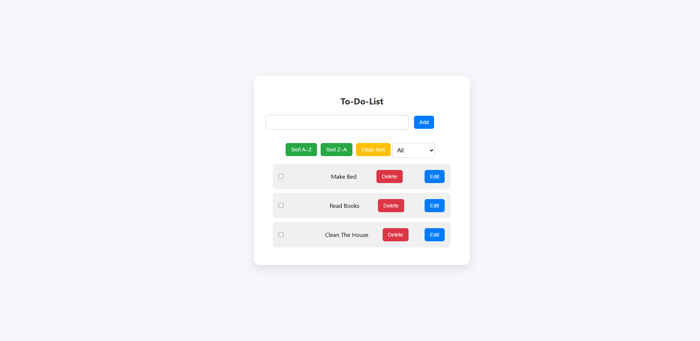
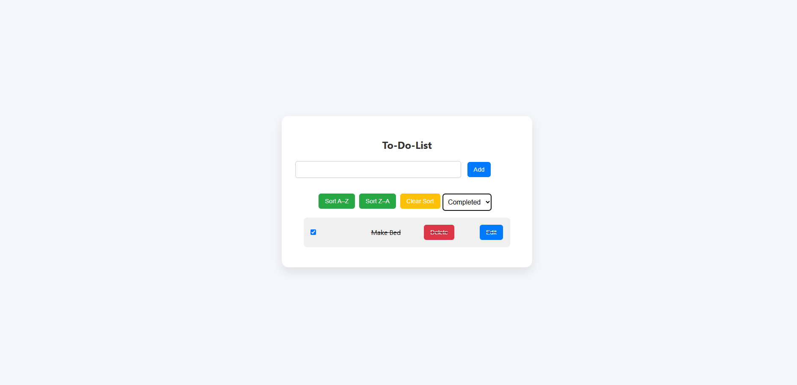
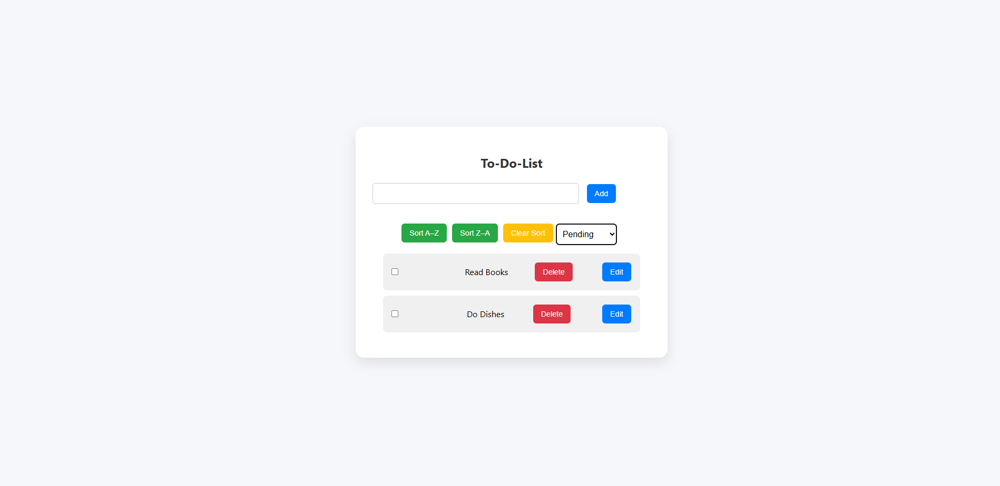

#React To-Do List App

A simple and responsive to-do list app built with React. This application helps you manage your daily tasks efficiently by allowing you to add, edit, delete, sort, and filter tasks. It also saves your tasks in the browser using localStorage so you don't lose them on page refresh.

## Features

- Add new tasks
- Edit existing tasks
- Delete tasks
- Mark tasks as completed or pending
- Filter tasks by:
  - All
  - Completed
  - Pending
- Sort tasks alphabetically (A–Z / Z–A)
- Persistent task storage using **localStorage**
- Responsive and clean UI with smooth interactions

## Built With

- React (with Hooks like `useState` and `useEffect`)
- CSS (custom styling for layout and responsiveness)

## Preview

